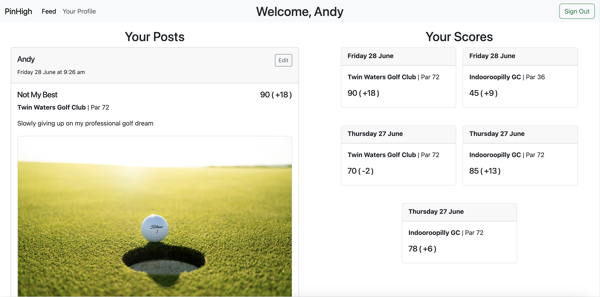

# PinHigh
> A Social Networking platform to connect golfers of all abilities.
> Live demo [_here_](https://pinhigh-260b99ff6644.herokuapp.com/).

## Table of Contents
* [General Info](#general-information)
* [Technologies Used](#technologies-used)
* [Features](#features)
* [Screenshots](#screenshots)
* [Project Status](#project-status)
* [Room for Improvement](#room-for-improvement)
* [Acknowledgements](#acknowledgements)


## General Information
- This Project is my second of four major projects submitted during the General Assembly Software Engineering Bootcamp
- PinHigh is a social networking app for golfers all abilities
- It connects golfers worldwide and provides a platform for users to share and track their golfing adventures
- More than just connecting golfers, PinHigh enables users to track their scoring history to gain valuable game improvement insights
- The platform is very much in a foundational state - with many more features coming soon that will further bolster it's ability to help golfers improve their game, such as:
  - Live handicap tracker and calculator
  - In depth score keeping
  - MyBag feature to track statistics and performance of each club you use
  - Instant messaging
  - Live scoring feature to keep score while you play


## Technologies Used
- ```Javascript, HTML, CSS, EJS```
- ```Mongoose, Express, Node.js```
- ```MongoDB, Cloudinary & Heroku```


## Features

- User Authentication
- News Feed page to browse posts by all users
- Create a post to share your:
  - Score
  - Golf Course
  - Comments on the round
  - Pictures
- Share likes and comments to connect with other users
- Your Profile:
  - View and edit your posts only
  - View your scorecard history


## Screenshots

<!-- If you have screenshots you'd like to share, include them here. -->


## Project Status
Project is: _in progress_.

PinHigh is very much in a fundamental state, offering only the ability to track scores, share posts and interact with other users posts. Planned features coming soon include:
- Live handicap tracker and calculator
- In depth score keeping
- MyBag feature to track statistics and performance of each club in your bag
- Instant messaging
- Live scoring feature to keep score while you play


## A Work In Progress

Having spent only a limited amount of time on this project so far, there are many areas that could be further improved upon. This project will be a continual work in progress, with various features and improvements (listed above) to be added along the way.


## Acknowledgements
- This project makes up the submission for my second of four major projects during the General Assembly Software Engineering Bootcamp
- Many thanks to Joel and CJ for their expert instruction and guidance along the way

